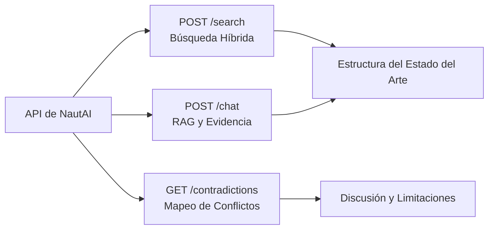

# NautAI Scientific Writing & Knowledge Compilation Skill

Este skill define la metodología y el protocolo para la escritura académica de alto impacto (Q1) y el uso de las capacidades de RAG (Retrieval-Augmented Generation) y Grafos de Conocimiento (KG) de NautAI para fundamentar la investigación hídrica y climática.

---

## 1. Régimen Epistémico de Redacción (R0, R1, R2)

Para asegurar la rigurosidad científica, cada afirmación en el manuscrito debe estar modulada de acuerdo con el nivel de confianza de la evidencia que la respalda. Se definen tres regímenes epistémicos:

### R0: Mecanismos y Definiciones Básicas (Confianza $\ge$ 0.50)
- **Definición**: Hechos físicos consolidados, leyes de la termodinámica, límites conceptuales definidos o ecuaciones fundamentales.
- **Estilo**: Declarativo directo y afirmativo. No requiere atenuantes.
- **Ejemplo**: *"El balance de energía en la superficie terrestre rige la tasa máxima de evaporación potencial bajo condiciones de saturación adiabática."*

### R1: Hallazgos Empíricos y Estadísticos (Confianza 0.40 - 0.49)
- **Definición**: Resultados experimentales, coeficientes de correlación calculados en el estudio, tendencias estadísticas o métricas de cross-validation.
- **Estilo**: Condicional y acotado al contexto o escala temporal analizada.
- **Ejemplo**: *"Los resultados indican que, a escala diaria, el índice CHSI y la temperatura superficial presentan una covarianza positiva ($R^2 = 0.289$, $p < 0.01$)."*

### R2: Afirmaciones Cualitativas y Discusión (Confianza < 0.40)
- **Definición**: Interpretaciones conceptuales, hipótesis sobre retroalimentaciones físicas o proyecciones metodológicas.
- **Estilo**: Cualificado con verbos de atenuación (*sugiere*, *podría*, *indica la posibilidad*).
- **Ejemplo**: *"La discrepancia observada entre el CHSI y los picos de precipitación corta sugiere la posibilidad de que el acuífero local amortigüe las respuestas hídricas superficiales."*

---

## 2. Patrones de Redacción Prohibidos (Pitfalls Académicos)

La redacción debe evitar vicios de lenguaje comunes que restan claridad o rigor al manuscrito:
1. **Em dashes (—)**: Queda estrictamente prohibido su uso para intercalar ideas. En su lugar, utilice comas, paréntesis o punto y coma.
2. **Transiciones vacías**: Evite conectores genéricos que no aporten contenido analítico (ej. *"En este sentido..."*, *"En relación con lo anterior..."*, *"Por otra parte..."*).
3. **Certidumbre sintética**: Evite expresiones que declaren verdades absolutas sin cita (ej. *"Está completamente demostrado que..."*, *"Es un hecho bien conocido que..."*).
4. **Simetría sintáctica**: Evite comenzar oraciones sucesivas con la misma estructura (ej. *"El modelo entrena..."*, *"El modelo valida..."*, *"El modelo predice..."*).
5. **Resultados mixtos vagos**: Prohibido escribir *"los estudios sobre este parámetro muestran resultados mixtos"* sin desglosar específicamente quiénes difieren, bajo qué condiciones y por qué.

---

## 3. Regla de Conflicto y Análisis de Discrepancias

Cuando dos fuentes bibliográficas o modelos presentan resultados contradictorios, **nunca se debe promediar ni diluir el hallazgo**. El conflicto debe tratarse como un objeto analítico bajo el siguiente esquema:
1. **Identificar la discrepancia**: Exponer claramente la diferencia estadística o física.
2. **Contextualizar las fuentes**: Detallar las diferencias de escala temporal, resolución espacial, variables consideradas o supuestos del modelo.
3. **Justificar la discrepancia**: Explicar físicamente el motivo de la diferencia.
4. **Derivar implicaciones**: Determinar cómo influye dicha contradicción en la interpretación del CHSI o en la línea de investigación actual.

---

## 4. Integración y Uso de NautAI (RAG/KG)

El sistema NautAI (`http://localhost:8000`) proporciona la evidencia empírica (átomos de conocimiento) que valida y respalda el manuscrito.

### Consultas Clave en NautAI:
- **Búsqueda Híbrida (`/projects/{project}/search`)**: Utilizada para descubrir papers y DOIs específicos sobre acoplamiento suelo-atmósfera y reanálisis ERA5-Land.
- **Consulta RAG (`/projects/{project}/chat`)**: Para formular preguntas directas sobre metodologías de normalización de índices de estrés hídrico y recuperar las citas asociadas en formato estructurado.
- **Grafo de Conocimiento (`/projects/{project}/graph/full`)**: Para visualizar las relaciones cruzadas entre conceptos clave (ej. *evapotranspiración* ↔ *humedad del suelo* ↔ *temperatura*).

---

## 5. Formato de Citas y Referencias (APA 7)

Toda la literatura compilada a través de NautAI debe integrarse bajo la norma APA 7:
- **Cita parentética**: `(Autor, Año)` o `(Autor1 & Autor2, Año)`. Para tres o más autores: `(Autor et al., Año)`.
- **Cita narrativa**: `Autor (Año)` o `Autor1 y Autor2 (Año)`.
- **Formato de Referencias**:
  - Debe incluir obligatoriamente el DOI en formato URL completa: `https://doi.org/10.xxxx/xxxx`.
  - Debe formatearse con sangría francesa (hanging indent).

---

## 6. Checklist de Validación para Envío a Journals

Antes de considerar el artículo listo para revisión:
- [ ] ¿Cada afirmación científica de R1 o R2 está respaldada por una cita traceable en la sección de referencias?
- [ ] ¿Los DOIs y metadatos de las referencias compiladas a través de NautAI corresponden a artículos reales y vigentes?
- [ ] ¿Se eliminaron todas las transiciones vacías y los guiones largos (em dashes)?
- [ ] ¿Se analizan físicamente las limitaciones de la escala espacial de ERA5-Land (~9 km) y cómo esto afecta la cuantificación a nivel de parcela?
- [ ] ¿El régimen epistémico de cada oración es coherente con el tipo de dato presentado?
