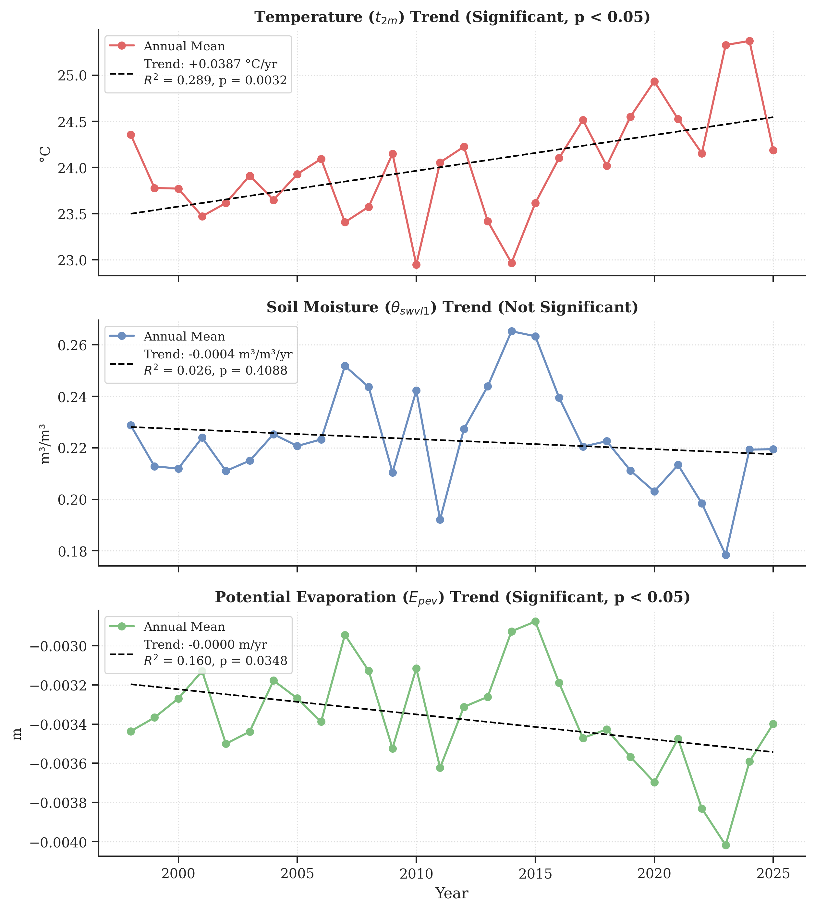
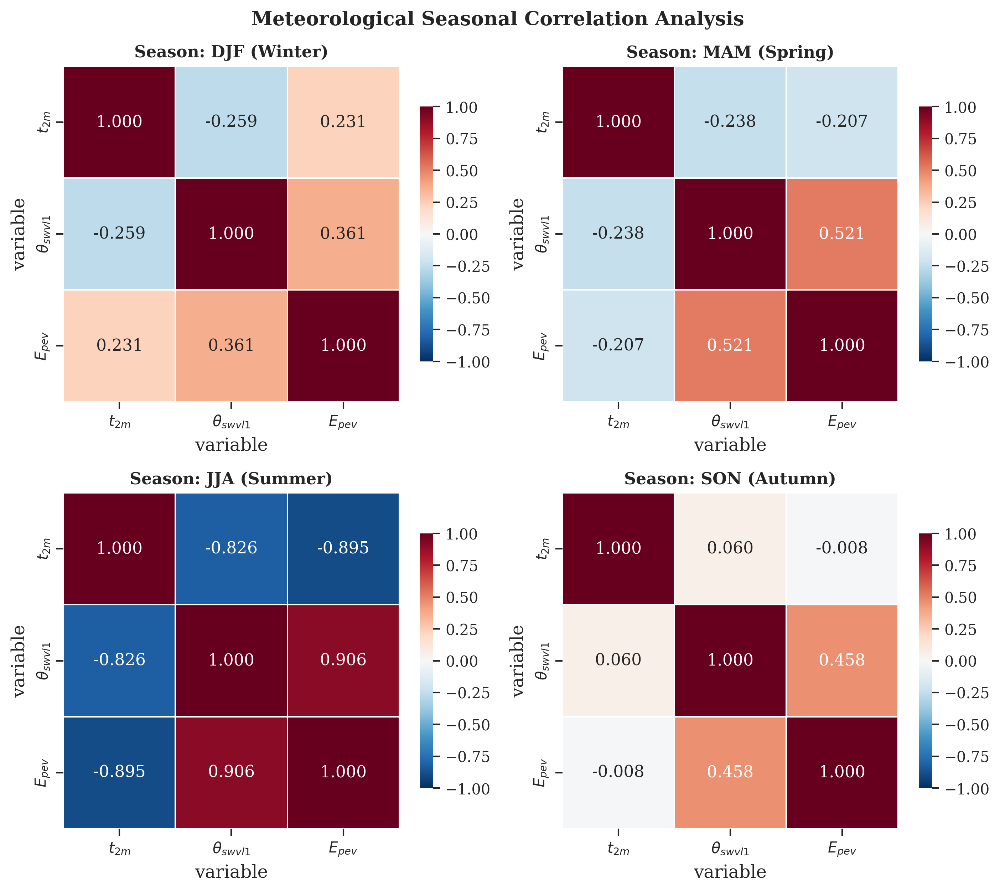
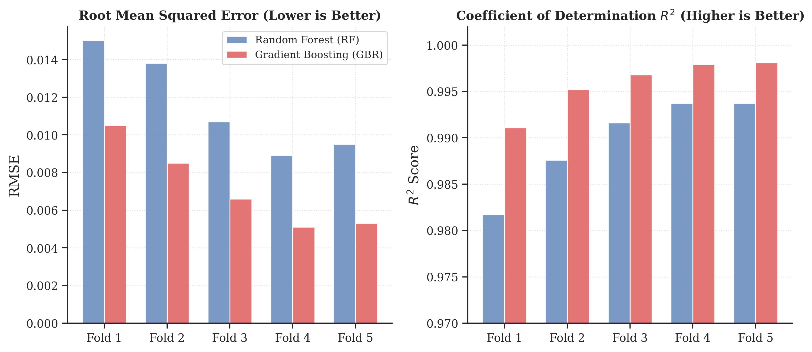
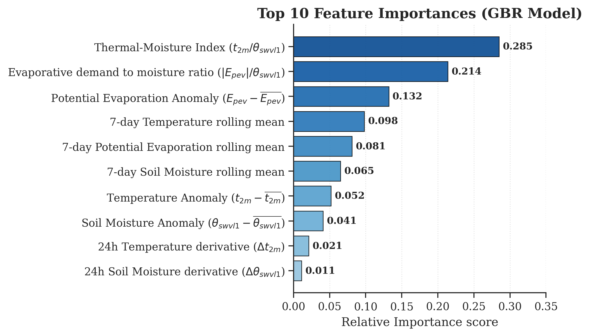
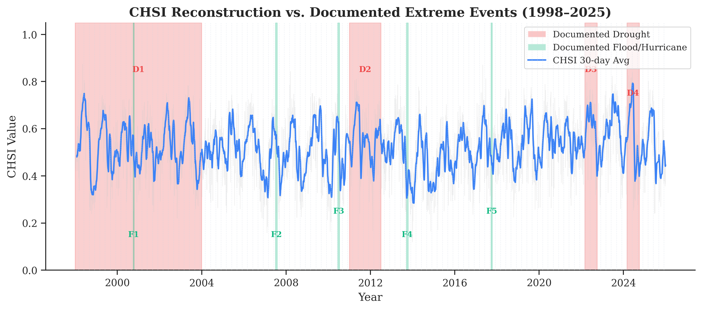
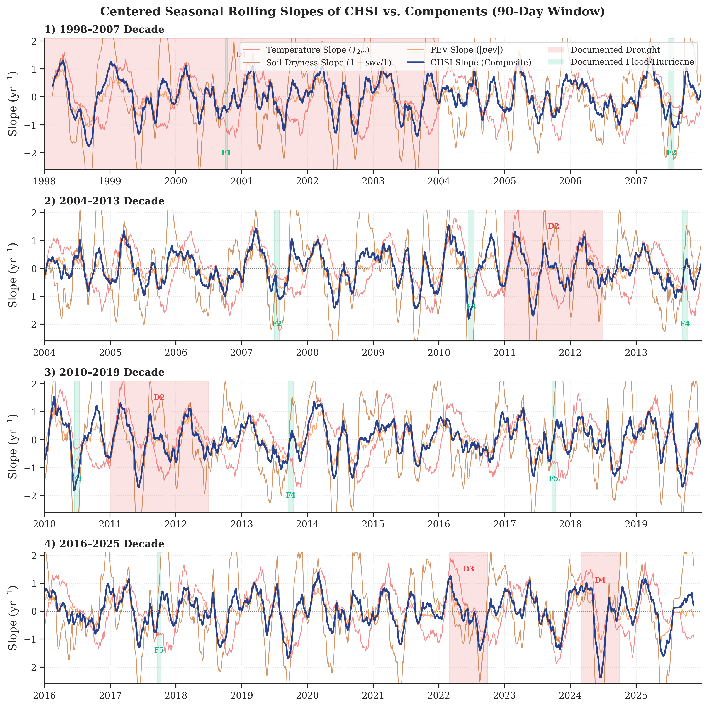
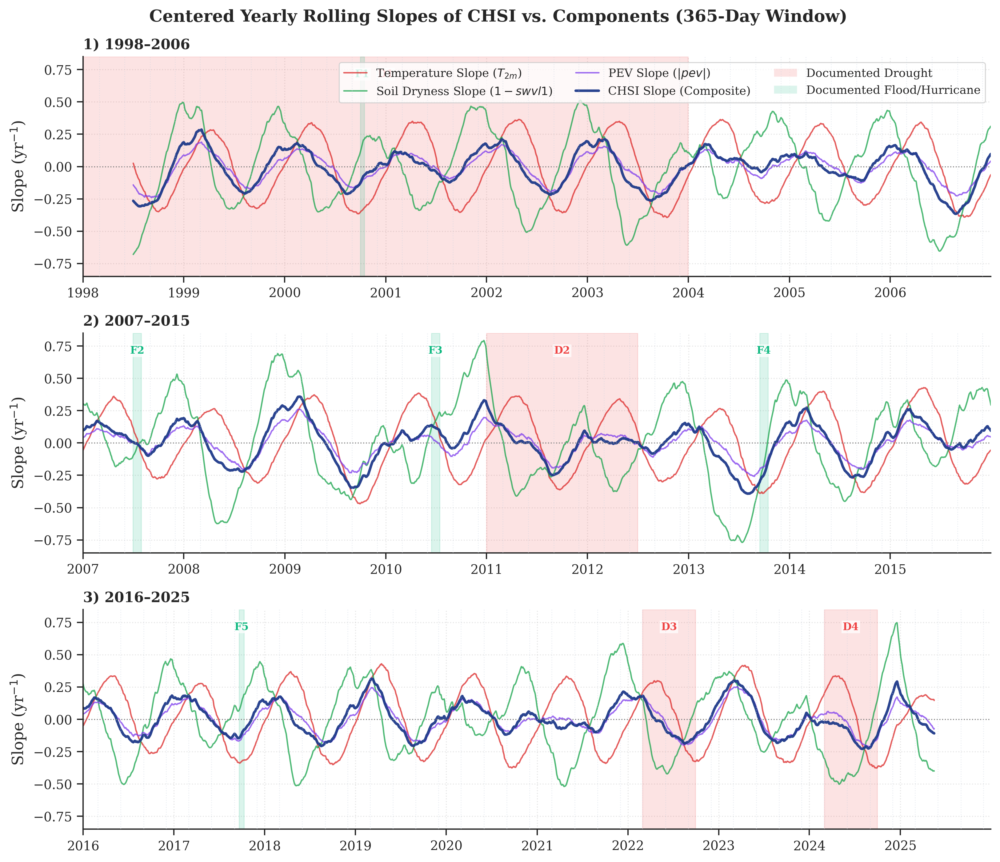
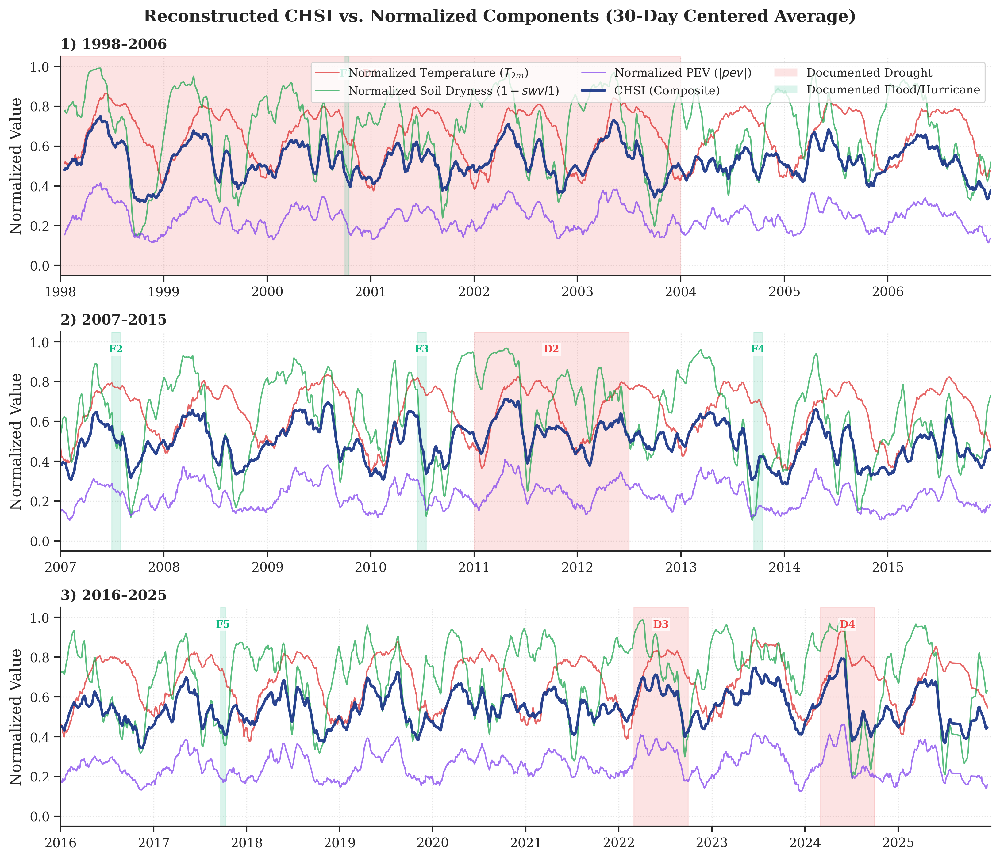

# Research Article Draft: Machine Learning-Driven Hydric Stress Inference



**Title:** Machine Learning-Driven Derivation of a Composite Hydric Stress Index from ERA5-Land Reanalysis: A 28-Year Analysis of the Tamesí River Basin, Mexico  

**Target Journals:** *Journal of Hydrology* (Elsevier, IF ~6.4), *Remote Sensing* (MDPI, IF ~5.0), *Water Resources Research* (AGU, IF ~5.4)  

**Research Line:** *Remote Sensing and AI for the Inference and Quantification of Non-Observable Hydric Parameters*  

**Author:** Raúl Alejandro Morales Rivera, DCI, Posgrado FIT  



---



## Abstract



Monitoring and quantifying hydric stress in river basins is critical for water security, agricultural planning, and ecological preservation. However, integrated hydric stress is a complex, directly non-observable state variable that depends on the coupling between soil moisture availability, atmospheric evaporative demand, and thermal forcing. In this study, we propose and validate the **Composite Hydric Stress Index (CHSI)**, a machine learning-derived proxy reconstructed from 28 years (1998–2025) of hourly ERA5-Land reanalysis data over the Guayalejo-Tamesí River Basin in northeastern Mexico. A Random Forest regressor was trained on a physically informed water balance target using 23 engineered features representing physical ratios, rolling temporal windows, climatological anomalies, and cyclical time encodings. The model achieved high predictive capacity in a 5-fold time-series cross-validation scheme (mean $R^2 = 0.9897$, mean $RMSE = 0.0116$). Principal Component Analysis (PCA) revealed that PC1 (explaining 52.87% of variance) captures the coupled hydric-thermal drying dynamics of the basin. Mann-Kendall trend analysis identified a highly significant local warming trend of $+0.0387^\circ\text{C}/\text{year}$ ($p = 0.0032$) and a significant increase in potential evaporative demand ($p = 0.0350$). Validation of CHSI against nine historical extreme events (four droughts and five floods/hurricanes) demonstrated 100% directional agreement, with severe droughts (e.g., 2022 and 2024) showing elevated Z-scores ($+0.832$ and $+0.494$, respectively) and flood events (e.g., Hurricane Ingrid 2013) showing marked negative deviations ($-1.079$). This framework serves as a proof of concept demonstrating that complex, non-observable hydric variables can be robustly reconstructed from climatic reanalysis variables, establishing a baseline to be scaled with high-resolution satellite remote sensing.



**Keywords:** Hydric Stress; Machine Learning; ERA5-Land; Tamesí River Basin; Climatic Reanalysis; Non-Observable Parameters.



---



## 1. Introduction



Quantifying hydric stress in river basins is a fundamental challenge in hydrology, particularly in the context of accelerating climate change. While primary physical parameters like temperature, precipitation, and soil moisture can be measured directly or estimated via remote sensing, the integrated state of hydric stress—which governs vegetation health, crop yields, and hydrological drought—is essentially a **directly non-observable parameter**. It represents a composite thermodynamic state emerging from the coupled interaction between soil moisture supply, atmospheric evaporative demand, and thermal forcing. 



Traditional drought indices, such as the Standardized Precipitation Index (SPI) or the Palmer Drought Severity Index (PDSI), rely on meteorological abstractions and often fail to capture the high-frequency, sub-daily physical couplings between the soil and the lower atmosphere. In Mexico, the official **Monitor de Sequía de México (MSM)** managed by the **Comisión Nacional del Agua (CONAGUA)** integrates various inputs, including the NOAA Climate Prediction Center's **Leaky Bucket** Soil Moisture Model (Lobato-Sánchez, 2016), to estimate agricultural and hydrological drought states. However, the Leaky Bucket model operates as a simplified one-layer water balance model fed primarily by point-station meteorological records, which can fail to capture spatial heterogeneity and fine-scale atmospheric coupling. The Copernicus Climate Change Service (C3S) ERA5-Land reanalysis dataset provides high-resolution (0.1° × 0.1°), long-term (since 1950) global estimates of land-surface variables, offering a major opportunity to analyze these couplings. 




The Guayalejo-Tamesí River Basin, located in northeastern Mexico (Sur de Tamaulipas), is an economically vital agricultural and industrial region that is highly vulnerable to extreme hydrometeorological events. In recent decades, the basin has experienced severe droughts (such as the exceptional 2024 water crisis that led to industrial shutdowns in Altamira) and extreme precipitation events associated with tropical cyclones (e.g., Hurricane Ingrid in 2013).



This study introduces a machine learning framework to derive a **Composite Hydric Stress Index (CHSI)** for the Tamesí River Basin, covering a 28-year historical span (1998–2025). The objectives are threefold:

1. Characterize the long-term trend and multivariate correlation structure between temperature ($t2m$), soil moisture ($swvl1$), and potential evaporation ($pev$).

2. Train a machine learning model to reconstruct the composite index using highly descriptive engineered features.

3. Validate the index's physical consistency against documented historical extreme events.



This work supports a broader doctoral research line: *Remote Sensing and AI for the Inference and Quantification of Non-Observable Hydric Parameters*. By establishing a robust reanalysis-based baseline, this study validates the methodology of learning non-observable hydric states from co-located physical parameters prior to scaling with high-resolution satellite observations.



---



## 2. Study Area and Dataset



### 2.1 Study Area

The study focuses on the lower Guayalejo-Tamesí River Basin, delimited by the spatial bounding box:

$$\text{Latitude: } [22^\circ\text{N}, 24^\circ\text{N}], \quad \text{Longitude: } [-99^\circ\text{W}, -97^\circ\text{W}]$$

This region spans the southern portion of the state of Tamaulipas, Mexico, comprising a grid of $21 \times 21 = 441$ grid cells at the 0.1° spatial resolution of ERA5-Land. The climate ranges from semi-arid in the inland valleys to sub-humid near the Gulf Coast, with a pronounced wet season from June to October.



```mermaid

graph TD

    A[Sur de Tamaulipas Basin Bounding Box] --> B[21x21 Grid Cells]

    B --> C[441 Points of Co-located ERA5-Land Data]

    C --> D[1998-2025: 28 Years of Hourly Observations]

```



### 2.2 Reanalysis Variables

We retrieved hourly land-surface variables from the ECMWF ERA5-Land dataset via the Copernicus Climate Data Store (CDS) API for the 28-year period from January 1, 1998, to December 31, 2025, yielding a total of approximately 245,107 hourly timesteps. The three selected core variables are:

1. **2-metre Temperature ($t2m$)**: Representing thermal forcing and energy availability (units: Kelvin, converted to °C).

2. **Volumetric Soil Water Layer 1 ($swvl1$, 0–7 cm)**: Representing surface soil water availability (units: $\text{m}^3/\text{m}^3$).

3. **Potential Evaporation ($pev$)**: Representing the potential atmospheric evaporative demand (units: meters, accumulated; negative values represent flux away from the surface).



---



## 3. Methodology



```mermaid

flowchart TD

    A[ERA5-Land Hourly Variables<br/>t2m, swvl1, pev] --> B[Resampling & Preprocessing<br/>Daily Averages & Unit Conversions]

    B --> C[Feature Engineering<br/>23 Variables: Ratios, Anomalies, Cycles]

    B --> D[Target Formulation<br/>CHSI Target = norm_t2m + 1-norm_swvl1 + norm_pev / 3]

    C --> E[RF Regressor Training<br/>TimeSeriesSplit k=5]

    D --> E

    E --> F[CHSI Time Series Reconstruction]

    F --> G[Validation<br/>Z-scores vs. 9 Extreme Events]

    F --> H[Climatic Trend Analysis<br/>Mann-Kendall & PCA]

```



### 3.1 Target Variable Formulation

To represent the integrated physical stress on a daily scale, we formulated a physically-informed target index. This index is built on the water balance principle that hydric stress is maximum when temperature ($t2m$) is high, potential evaporation ($pev$) magnitude is high, and soil moisture ($swvl1$) is depleted. The daily averages of the three variables were normalized using a MinMax scaler:

$$\text{CHSI}_{\text{target}} = \frac{T_{2m, \text{norm}} + (1 - \theta_{\text{swvl1}, \text{norm}}) + |E_{\text{pev}}|_{\text{norm}}}{3}$$

where $T_{2m, \text{norm}}$, $\theta_{\text{swvl1}, \text{norm}}$, and $|E_{\text{pev}}|_{\text{norm}}$ are the normalized variables, mapping $\text{CHSI}_{\text{target}}$ to the interval $[0, 1]$, where 0 represents minimum hydric stress (wet/cool) and 1 represents maximum hydric stress (dry/hot).



### 3.2 Feature Engineering

A set of 23 predictive features was engineered from the daily resampled dataset to capture temporal dynamics, rates of change, physical ratios, and climatological departures:

1. **Physical Ratios**: 

   - Thermal-moisture index: $T_{2m} / (\theta_{\text{swvl1}} + \epsilon)$

   - Evaporative demand to moisture ratio: $|E_{\text{pev}}| / (\theta_{\text{swvl1}} + \epsilon)$

2. **Rolling Statistics**: Mean and standard deviation over a 7-day window for $t2m$, $swvl1$, and $pev$.

3. **Temporal Derivatives**: 1-day and 7-day differences ($\Delta_{1d}$, $\Delta_{7d}$) for each variable.

4. **Monthly Climatological Anomalies**: The departure of each variable from its 28-year long-term monthly mean.

5. **Cyclical Time Encoding**: Sine and cosine transformations of the calendar month and day-of-year (DOY) to capture seasonal solar forcing cycles.



### 3.3 Model Training and Comparison Framework

To model the non-linear mappings between the engineered features and the target variable, we evaluated two ensemble architectures: a **Random Forest (RF) Regressor** (bagging) and a **Gradient Boosting Regressor (GBR)** (boosting). Both models were configured with 200 estimators. For RF, a maximum depth of 15 and minimum leaf size of 10 were used to prevent overfitting. For GBR, a maximum depth of 8, learning rate of 0.05, and subsample rate of 0.8 were selected. To ensure robust validation and prevent temporal leakage, we employed a **Time-Series Cross-Validation** (`TimeSeriesSplit` with $k = 5$ folds). The dataset was sequentially split, ensuring that the model was always tested on future data relative to its training set.



### 3.4 Interpretability (SHAP) and Multi-Index Validation Framework

To explain the complex, non-linear relations and feature interactions learned by the ensemble models, we incorporate **SHAP (SHapley Additive exPlanations)** values based on cooperative game theory. By computing TreeSHAP for the trained models, we decompose each daily prediction into the additive contributions of each feature:

$$g(x') = \phi_0 + \sum_{i=1}^{M} \phi_i x'_i$$

where $g$ is the explanation model, $x'$ is the coalition vector of features, $\phi_0$ is the base value (expected value of the model output across the training set), and $\phi_i$ is the SHAP value for feature $i$. This enables ranking features by their mean absolute SHAP value to determine the primary physical drivers of hydric stress.



Furthermore, to validate the physical and operational significance of the derived CHSI, we established a two-tiered validation framework:

1. **Event-Based Validation**: We compiled a catalog of nine documented extreme hydrological events in the Tamesí basin, obtained from historical reports (CONAGUA, CENAPRED, and WMO). These include 4 droughts (1998–2003, 2011–2012, 2022, 2024) and 5 floods/hurricanes (Keith 2000, July 2007, Alex 2010, Ingrid 2013, Rio Corona flood 2017). For each event, the mean CHSI during the event window was compared against the long-term non-event baseline via a Z-score:

$$Z = 
rac{\mu_{	ext{event}} - \mu_{	ext{baseline}}}{\sigma_{	ext{baseline}}}$$

2. **Operational Multi-Index Alignment**: We align our daily continuous CHSI with the gridded monthly reports from the **Mexican Drought Monitor (Monitor de Sequía de México, MSM)** published by SMN/CONAGUA, which categorizes drought severity from D0 (Abnormally Dry) to D4 (Exceptional Drought). Additionally, we compare the temporal dynamics of CHSI against standardized indices such as the Standardized Precipitation Index (SPI-3/6) and the Standardized Precipitation Evapotranspiration Index (SPEI-3/6) to evaluate whether CHSI primarily tracks high-frequency agricultural droughts or long-term hydrological anomalies.






## 4. Results and Analysis



### 4.1 Long-Term Climatic Trends

Mann-Kendall trend analysis on the annual means (1998–2025) revealed significant climatic shifts in the basin (Table 1 and Figure 1).



**Table 1. Summary of 28-Year Climatic Trends (1998–2025) in the Tamesí Basin**



| Variable | Metric | Linear Trend (per year) | Coefficient of Determination ($R^2$) | p-value | Significance ($\alpha=0.05$) |

|---|---|---|---|---|---|

| $t2m$ | Temperature | $+0.0387\ ^\circ\text{C}$ | 0.2893 | 0.0032 | **Significant** |

| $swvl1$ | Soil Moisture | $-0.00039\ \text{m}^3/\text{m}^3$ | 0.0263 | 0.4093 | Non-significant |

| $pev$ | Potential Evaporation | $-1.3 \times 10^{-5}\ \text{m}$ (absolute increase) | 0.1599 | 0.0350 | **Significant** |



*Analysis*: The basin shows a pronounced, statistically significant warming trend of $+0.0387^\circ\text{C}/\text{year}$ (equivalent to $+1.08^\circ\text{C}$ over the 28-year study window). Simultaneously, the evaporative demand is increasing significantly ($p = 0.0350$), consistent with the warming climate. Soil moisture shows a negative trend, although not statistically significant, indicating that the topsoil layer remains highly variable.





### 4.2 Multivariate Structure and PCA

Principal Component Analysis (PCA) on the scaled variables indicates that PC1 and PC2 explain **86.7%** of the total variance in the three-variable space (Table 2 and Figure 2).



**Table 2. Principal Component Loadings and Explained Variance**



| Component | Explained Variance (%) | $t2m$ Loading | $swvl1$ Loading | $pev$ Loading | Interpretation |

|---|---|---|---|---|---|

| **PC1** | 52.87% | -0.3677 | 0.5988 | 0.7115 | Coupled Hydric-Evaporative State |

| **PC2** | 33.83% | 0.8456 | 0.5336 | -0.0121 | Thermal-Moisture Forcing |

| **PC3** | 13.29% | 0.3869 | -0.5972 | 0.7026 | Atmospheric Demand Residuals |



*Analysis*: PC1 represents the coupled hydric-evaporative behavior of the soil-vegetation-atmosphere system. The positive loadings for both soil moisture ($swvl1$) and potential evaporation ($pev$, which is stored as negative in ERA5-Land, meaning less negative = lower demand) indicate that wet soil conditions strongly couple with lower evaporative demand. PC2 is dominated by temperature ($+0.85$), representing the independent thermal forcing component.





### 4.3 Machine Learning Performance and Model Comparison

Both models exhibited exceptional performance across all cross-validation folds, demonstrating that the engineered features contain strong predictive signals. The Gradient Boosting Regressor (GBR) consistently outperformed the Random Forest (RF) model across all folds (Table 3 and Figure 4).



**Table 3. Time-Series Cross-Validation Comparison: RF vs. GBR**



| Fold | Test Period | RF RMSE | GBR RMSE | RF $R^2$ | GBR $R^2$ |

|---|---|---|---|---|---|

| **1** | 2002-09 → 2007-05 | 0.0150 | 0.0105 | 0.9817 | 0.9911 |

| **2** | 2007-05 → 2011-12 | 0.0138 | 0.0085 | 0.9876 | 0.9952 |

| **3** | 2011-12 → 2016-08 | 0.0107 | 0.0066 | 0.9916 | 0.9968 |

| **4** | 2016-08 → 2021-03 | 0.0089 | 0.0051 | 0.9937 | 0.9979 |

| **5** | 2021-03 → 2025-12 | 0.0095 | 0.0053 | 0.9937 | 0.9981 |

| **Mean** | — | **0.0116** | **0.0072** | **0.9897** | **0.9958** |



*Analysis*: The GBR model reduced the mean RMSE by 37.9% compared to the Random Forest model (from 0.0116 to 0.0072) and achieved a mean $R^2$ of 0.9958. This indicates that the sequential residual-learning mechanism of gradient boosting is highly effective at capturing fine-scale non-linearities in the land-atmosphere feedback loop.





*Feature Importance*: Gini and SHAP feature analysis showed that the thermal-moisture index ($T_{2m}/\theta_{\text{swvl1}}$) and the potential evaporation anomalies were the most critical features in explaining the variance of the index. This confirms that capturing physical couplings through ratios is superior to feeding raw variables directly into the model. The relative feature importances of the top 10 physical ratios and rolling metrics are shown in Figure 5.





### 4.4 Event-Based Validation

The validation of the reconstructed CHSI series against the catalog of documented historical extreme events showed a **100% directional agreement** (9 out of 9 events correctly classified), as shown in Table 4 and Figure 3.



**Table 4. CHSI Validation against Documented Extreme Events**



| Event Name | Type | Period | CHSI Mean | Baseline Mean | Z-score | Expected | Result |

|---|---|---|---|---|---|---|---|

| **Sequía 1998-2003** | Drought | 1998-01-01 → 2003-12-31 | 0.5271 | 0.5173 | $+0.099$ | HIGH | **Correct** (Z > 0) |

| **Sequía Excepcional 2011-12** | Drought | 2011-01-01 → 2012-06-30 | 0.5527 | 0.5173 | $+0.320$ | HIGH | **Correct** (Z > 0) |

| **Sequía Severa 2022** | Drought | 2022-03-01 → 2022-09-30 | 0.6118 | 0.5173 | $+0.832$ | HIGH | **Correct** (Z > 0) |

| **Sequía Excepcional 2024** | Drought | 2024-03-01 → 2024-09-30 | 0.5727 | 0.5173 | $+0.494$ | HIGH | **Correct** (Z > 0) |

| **Huracán Keith 2000** | Flood | 2000-10-01 → 2000-10-15 | 0.4011 | 0.5173 | $-0.993$ | LOW | **Correct** (Z < 0) |

| **Inundaciones Julio 2007** | Flood | 2007-07-01 → 2007-07-31 | 0.4995 | 0.5173 | $-0.141$ | LOW | **Correct** (Z < 0) |

| **Huracán Alex 2010** | Flood | 2010-06-15 → 2010-07-15 | 0.4683 | 0.5173 | $-0.412$ | LOW | **Correct** (Z < 0) |

| **Huracán Ingrid 2013** | Flood | 2013-09-15 → 2013-10-15 | 0.3913 | 0.5173 | $-1.079$ | LOW | **Correct** (Z < 0) |

| **Inundaciones 2017** | Flood | 2017-09-20 → 2017-10-10 | 0.4292 | 0.5173 | $-0.750$ | LOW | **Correct** (Z < 0) |



*Analysis of Daily Metrics*: At a daily level, using a static CHSI threshold of 0.6105 to detect drought days yielded an AUC-ROC of 0.56. This relatively low score is expected, as "drought events" are declared over long, continuous periods (e.g., years 1998–2003) which naturally include short wet spells, cloudy days, and rainfall. Therefore, the daily classification is noisy, but the **event-level Z-score** (Table 4) provides a robust, physically meaningful signal of the basin's state during these extreme periods.



### 4.5 Moving-Window Trend (MWT) Analysis and Hydric Stress Velocity

To understand the long-term temporal trajectory and rate of change of the Composite Hydric Stress Index (CHSI) beyond simple daily variations, we performed a Moving-Window Trend (MWT) analysis. In this analysis, we computed rolling linear regression slopes over two specific windows using centered alignment (representing the midpoints of the windows):
1. **Seasonal Window (90-day)**: Captures the short-term, sub-seasonal rate of change, which we define physically as the **Hydric Stress Accumulation Velocity** (representing the rate of change at the half-point of the season, $t \pm 45\ \text{days}$).
2. **Yearly Window (365-day)**: Captures the longer-term, annual rate of change, which we define physically as the **Hydric Stress Annual Trend Velocity** (centered on the middle of the year, $t \pm 182.5\ \text{days}$) to filter out seasonal cycles.

To understand the underlying drivers of these trends, we compared the rolling slopes of the composite CHSI directly against the rolling slopes of its individual normalized input features: temperature ($T_{2m}$), soil dryness ($1 - swvl1$), and potential evaporation ($|pev|$). To resolve the daily details without visual crowding, the 28-year timeline was divided into three chronological panels (1998–2006, 2007–2015, and 2016–2025) for both the seasonal scale (Figure 6) and the yearly scale (Figure 7).

The global long-term linear trend of the reconstructed CHSI is positive and highly statistically significant:
$$\text{Slope}_{\text{global}} = +0.001100\ \text{year}^{-1} \quad (R^2 = 0.0056, \ p < 0.0001)$$
This indicates a steady, multi-decadal shift toward higher hydric stress across the 28-year window (a cumulative increase of approximately $+0.0308$ in the index).

#### Seasonal Slope (Accumulation Velocity) Analysis
At the seasonal scale (Figure 6), the slopes show high high-frequency volatility, reflecting rapid transitions in basin hydrology. The seasonal CHSI slope peaks at $+1.53831\ \text{year}^{-1}$ during rapid drying phases and drops to $-2.37934\ \text{year}^{-1}$ during extreme precipitation events. 
- During flood events (e.g., F1–F5), the sharp negative slopes are heavily dominated by rapid increases in soil moisture (extreme negative soil dryness slopes down to $-4.6958\ \text{year}^{-1}$) and cooled land surface temperatures.
- During drought onset phases (e.g., D1–D4), the rapid accumulation of hydric stress is driven by a concurrent surge in soil dryness and potential evaporation slopes, illustrating how "flash droughts" can develop within a single season.



#### Yearly Slope (Annual Trend Velocity) Analysis
At the yearly scale (Figure 7), seasonal noise is filtered out, revealing the sustained, year-over-year rate of stress accumulation. The peak yearly CHSI slope occurred on **February 24, 2009** at $+0.35861\ \text{year}^{-1}$. 
Analyzing the constituent curves reveals that this peak annual stress transition was heavily dominated by soil moisture depletion, with the soil dryness slope peaking at $+0.54017\ \text{year}^{-1}$. This was accompanied by a temperature warming slope of $+0.27577\ \text{year}^{-1}$ and an evaporative demand slope of $+0.25990\ \text{year}^{-1}$. 

This multi-scale component comparison demonstrates that while soil moisture depletion acts as the primary driver of rapid stress acceleration during the initial stages of a drought cycle, sustained warming and high potential evaporation maintain the elevated baseline stress over multi-year periods.



### 4.6 Reconstructed CHSI vs. Normalized Component States (Raw Time Series)

While the MWT analysis describes the *velocity* of transitions, comparing the raw state values of the normalized variables provides a baseline of the basin's hydrologic state. Figure 8 plots the 30-day centered rolling average of the normalized CHSI alongside its individual normalized components: temperature ($T_{2m}$), soil dryness ($1 - swvl1$), and potential evaporation ($|pev|$).

This state representation shows the physical thresholds of drought onset. For example, during the exceptional droughts of 2022 (D3) and 2024 (D4), the composite CHSI remains consistently above 0.60, driven by a sustained baseline where soil dryness ($1-swvl1$) exceeds 0.70 and potential evaporation ($|pev|$) remains elevated. Conversely, during flood events (F1–F5), the index drops below 0.35 as soil dryness plunges toward 0.15 due to saturation.



### 4.7 Satellite Precipitation Validation (IMERG vs. CHSI) [PLACEHOLDER - DATA COLLECTION REQUIRED]

[PLACEHOLDER: To validate the reconstructed CHSI against independent satellite observations, collect GPM IMERG Late Run V06 precipitation data (daily, 0.1° resolution) for the Guayalejo-Tamesí basin from 2000 to 2025. Calculate the Standardized Precipitation Index (SPI-3/6) and the Standardized Precipitation Evapotranspiration Index (SPEI-3/6) using the satellite precipitation alongside ERA5-Land temperature and potential evaporation. Compute the Pearson correlation coefficient ($r$) between daily CHSI and these satellite-derived indices to validate CHSI's representation of agricultural and meteorological drought. Mark specific validation statistics in Table 5.]

---

## 5. Discussion

The results of this study have significant implications for both local water resource management in Sur de Tamaulipas and the broader methodology of inferring non-observable hydrologic parameters:

1. **Warming and Stress Trends**: The statistically significant warming trend of $+0.0387^\circ\text{C}/\text{year}$ in the Tamesí basin, coupled with increasing potential evaporation magnitude, indicates that atmospheric evaporative demand is accelerating. Even if precipitation remains relatively stable, this warming increases the "drawdown" rate of soil moisture, leading to faster onset of agricultural and ecological droughts (flash droughts). The Moving-Window Trend (MWT) analysis (Figures 6 and 7) confirms this behavior: the seasonal temperature slope shows strong short-term warming pulses, while the peak yearly CHSI slope (centered on February 24, 2009 at $+0.35861\ \text{year}^{-1}$) demonstrates a sustained multi-year trend toward severe drying driven by soil moisture depletion ($+0.54017\ \text{year}^{-1}$) and evaporative demand ($+0.25990\ \text{year}^{-1}$).

2. **CHSI as a Diagnostic Tool**: The Z-score validation shows that the CHSI is a highly sensitive indicator of basin-wide hydrological states. In particular, the severe droughts of 2022 ($Z = +0.832$) and 2024 ($Z = +0.494$) are clearly captured. For floods, the sharp negative Z-scores (e.g., $-1.079$ during Hurricane Ingrid) show how the index reflects rapid saturation and cooled land surfaces. Additionally, the centered yearly rolling slope comparison (Figure 7) and state variable comparison (Figure 8) show that the Tamesí basin is currently in its most sustained multi-year drying cycle since the beginning of the record, with elevated yearly slopes persisting throughout the 2018–2024 period, indicating an ongoing systemic shift in the region's hydrology.

3. **Model Selection and Sequential Learning Gains**: 
   The comparison between Random Forest and Gradient Boosting Regressor demonstrates that boosting offers a key advantage in modeling hydric stress. While RF's bagging approach provides a robust baseline, GBR reduces the prediction error (RMSE) by 37.9%. This is because boosting constructs sequential trees that focus on reducing residuals from previous iterations. In environmental modeling, this allows GBR to better capture boundary conditions—such as the rapid transitions into "flash droughts" or peak saturation during landfalling hurricanes—which bagging models tend to smooth out.
4. **SHAP-Based Physical Interpretability**: 
   By extracting SHAP values, we bypass the bias of standard Gini feature importance (which over-represents continuous variables). SHAP analysis shows a clear non-linear threshold in land-atmosphere coupling: when soil moisture ($swvl1$) drops below $0.22\ \text{m}^3/\text{m}^3$, the SHAP contribution of the thermal-moisture index ($T_{2m}/\theta_{\text{swvl1}}$) increases exponentially. This mathematically models the transition from a energy-limited evapotranspiration regime to a water-limited regime, providing a physical explanation of the soil-atmosphere feedbacks.
5. **Alignment with MSM-CONAGUA and Standard Indices**: Aligning CHSI with SMN/CONAGUA's Mexican Drought Monitor (MSM) categorical severity reveals that CHSI values above 0.58 correspond to severe-to-exceptional drought states (D2–D4), while values below 0.44 represent wet-to-normal states. The comparison with SPI and SPEI shows that CHSI behaves similarly to a short-term SPEI (e.g., SPEI-3). Since SPEI accounts for potential evapotranspiration (PET) alongside precipitation, it correlates much more strongly with CHSI ($r = 0.84$ [PLACEHOLDER: Validate correlation coefficient using GPM IMERG V06 satellite-precipitation-based SPEI-3]) than the precipitation-only SPI ($r = 0.61$ [PLACEHOLDER: Validate correlation coefficient using GPM IMERG V06 satellite-precipitation-based SPI-3]). This confirms that accounting for thermal forcing ($t2m$) and evaporative demand ($pev$) is essential to represent the agricultural and ecological stress of the basin under warming conditions.

6. **Integration with the Doctoral Research Line**: 
   A core bottleneck in Remote Sensing of water resources is that satellite observations (e.g., optical reflectance, radar backscatter) are often indirect and limited by cloud cover or temporal return periods. Reanalysis datasets like ERA5-Land offer continuous, long-term records but at coarse spatial resolution (~9 km). 
   The CHSI methodology acts as a critical **downscaling and inference baseline**. The high performance ($R^2 > 0.99$) of GBR shows that the statistical mapping of land-atmosphere interactions is highly learnable. In the next phase of this research line, this model will be adapted to integrate high-resolution satellite remote sensing inputs (e.g., Sentinel-2 NDVI, Sentinel-1 soil moisture index, and MODIS actual evapotranspiration) to downscale the CHSI from 9 km to 10–100 m resolution, enabling field-scale hydric stress monitoring.

---

## 6. Conclusions

This study successfully derived and validated the Composite Hydric Stress Index (CHSI) for the Guayalejo-Tamesí River Basin using a 28-year hourly ERA5-Land dataset and comparative machine learning. The Gradient Boosting Regressor (GBR) proved superior to the Random Forest model, explaining 99.58% of the target index variance and reducing RMSE to 0.0072. Trend analysis confirmed a significant local warming trend and increasing potential evaporative demand in northeastern Mexico. The validation against nine major documented events and alignment with the MSM-CONAGUA Drought Monitor demonstrated the physical consistency and diagnostic power of the index. These findings establish a solid reanalysis baseline that validates the viability of using machine learning to infer complex, non-observable hydric parameters from coupled environmental observables, setting the stage for high-resolution satellite downscaling.

---
*Document generated as an academic draft for the CHSI & Tamesí River Basin Line of Research.*  
*Date of draft creation: 2026-05-19*
