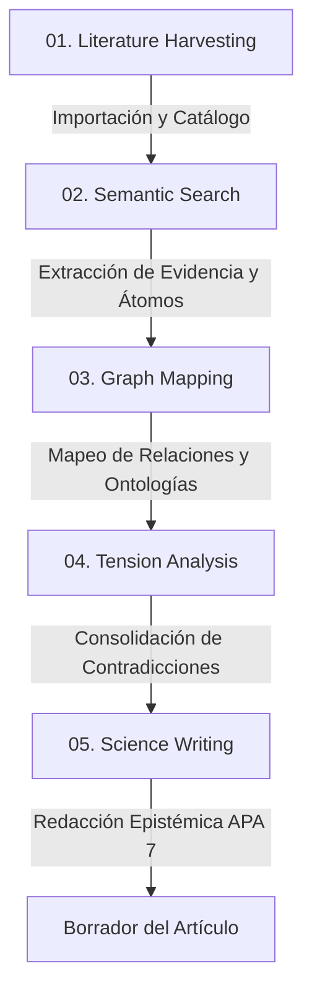

# NautAI Research Agent Skills Directory

Este directorio contiene las especificaciones de habilidades (skills) estructuradas para agentes que realizan investigación científica y redacción doctoral utilizando el backend de destilación de conocimiento **NautAI** (`http://localhost:8000`).

## Pipeline de Investigación Basado en Datos Estructurados

Para automatizar el proceso de investigación sin depender del endpoint conversacional de interfaz de usuario (`/chat`), el agente debe operar a través de cinco etapas modulares:

## Directorio de Skills

1.  **[01-literature-harvesting.md](file:///c:/git/APPS/CDS/skills/01-literature-harvesting.md)**: Importación de papers (.pdf y exportaciones WoS) y catalogación bibliométrica de la base documental.
2.  **[02-semantic-search.md](file:///c:/git/APPS/CDS/skills/02-semantic-search.md)**: Búsquedas híbridas estructuradas sobre átomos de conocimiento, ajuste de pesos y umbrales.
3.  **[03-graph-mapping.md](file:///c:/git/APPS/CDS/skills/03-graph-mapping.md)**: Extracción del grafo de conocimiento enriquecido y mapeo de ontologías conceptuales.
4.  **[04-tension-analysis.md](file:///c:/git/APPS/CDS/skills/04-tension-analysis.md)**: Detección sistemática de contradicciones, discrepancias físicas/estadísticas y consensos.
5.  **[05-science-writing.md](file:///c:/git/APPS/CDS/skills/05-science-writing.md)**: Reglas de redacción científica, régimen epistémico R0/R1/R2, formato APA 7 y control de estilo.

Cada archivo detalla **cuándo** activar el skill, **cómo** ejecutar las llamadas a la API de Naut, y **de qué manera** validar y aplicar los resultados obtenidos.
